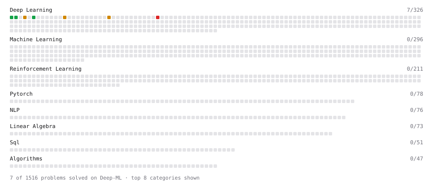

# Deep-ML

My machine learning practice from [Deep-ML](https://www.deep-ml.com). Every solution here was written by hand.

**19** solved · 16 problems · 1 labs · 2 math

[**Browse the interactive portfolio**](https://leolarriven.github.io/deep-ml/) to replay this filling in over time.

## Problems

| | Difficulty | Solved | |
| --- | --- | --- | --- |
| [Compute a Gradient with PyTorch Autograd](https://www.deep-ml.com/problems/884) | easy | 2026-10-06 | [solution](problems/0884-compute-a-gradient-with-pytorch-autograd) |
| [Create a Float Tensor from a Python List](https://www.deep-ml.com/problems/880) | easy | 2026-10-06 | [solution](problems/0880-create-a-float-tensor-from-a-python-list) |
| [Derivatives of Activation Functions](https://www.deep-ml.com/problems/217) | easy | 2026-10-06 | [solution](problems/0217-derivatives-of-activation-functions) |
| [Implement a Linear Layer Forward Pass with Matrix Multiplication](https://www.deep-ml.com/problems/883) | easy | 2026-10-06 | [solution](problems/0883-implement-a-linear-layer-forward-pass-with-matrix-multiplication) |
| [Implement Binary Cross-Entropy Loss](https://www.deep-ml.com/problems/263) | easy | 2026-10-06 | [solution](problems/0263-implement-binary-cross-entropy-loss) |
| [Implement ReLU and Leaky ReLU](https://www.deep-ml.com/problems/1226) | easy | 2026-10-06 | [solution](problems/1226-implement-relu-and-leaky-relu) |
| [Implementation of Log Softmax Function](https://www.deep-ml.com/problems/39) | easy | 2026-10-06 | [solution](problems/0039-implementation-of-log-softmax-function) |
| [Mean Squared Error from Scratch](https://www.deep-ml.com/problems/1228) | easy | 2026-10-06 | [solution](problems/1228-mean-squared-error-from-scratch) |
| [Sigmoid Activation Function Understanding](https://www.deep-ml.com/problems/22) | easy | 2026-10-05 | [solution](problems/0022-sigmoid-activation-function-understanding) |
| [Softmax Activation Function Implementation ](https://www.deep-ml.com/problems/23) | easy | 2026-10-05 | [solution](problems/0023-softmax-activation-function-implementation) |
| [Implement PReLU Forward and Backward Pass](https://www.deep-ml.com/problems/98) | medium | 2026-10-05 | [solution](problems/0098-implement-prelu-forward-and-backward-pass) |
| [Implementing a Simple RNN](https://www.deep-ml.com/problems/54) | medium | 2026-10-05 | [solution](problems/0054-implementing-a-simple-rnn) |
| [Power Users With Purchases in Every Month of the Year](https://www.deep-ml.com/problems/1462) | medium | 2026-10-06 | [solution](problems/1462-power-users-with-purchases-in-every-month-of-the-year) |
| [Single Neuron with Backpropagation](https://www.deep-ml.com/problems/25) | medium | 2026-10-05 | [solution](problems/0025-single-neuron-with-backpropagation) |
| [Two-Layer MLP Forward Pass](https://www.deep-ml.com/problems/1225) | medium | 2026-10-06 | [solution](problems/1225-two-layer-mlp-forward-pass) |
| [Implement a Sparse Mixture of Experts Layer](https://www.deep-ml.com/problems/125) | hard | 2026-10-05 | [solution](problems/0125-implement-a-sparse-mixture-of-experts-layer) |

## Labs

| | Difficulty | Solved | |
| --- | --- | --- | --- |
| [Design Your Own Activation Function](https://www.deep-ml.com/labs/9) | easy | 2026-10-06 | [solution](labs/0009-design-your-own-activation-function) |

## Math

| | Difficulty | Solved | |
| --- | --- | --- | --- |
| [Log-Likelihood Gradients](https://www.deep-ml.com/math-problems/38) | medium | 2026-10-06 | [solution](math/0038-log-likelihood-gradients) |
| [Softmax and Cross-Entropy](https://www.deep-ml.com/math-problems/32) | medium | 2026-10-06 | [solution](math/0032-softmax-and-cross-entropy) |

---

_This file is regenerated by Deep-ML on every push._
